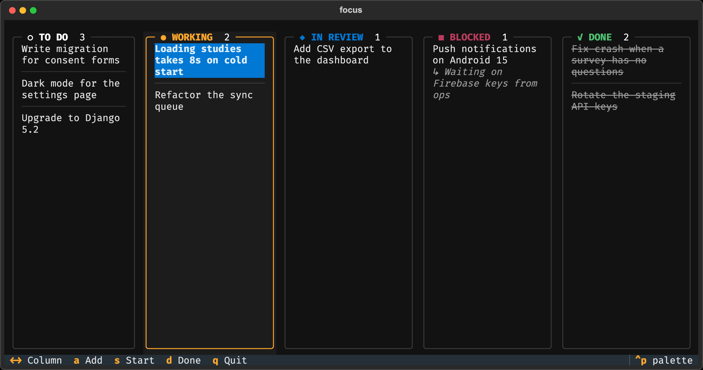
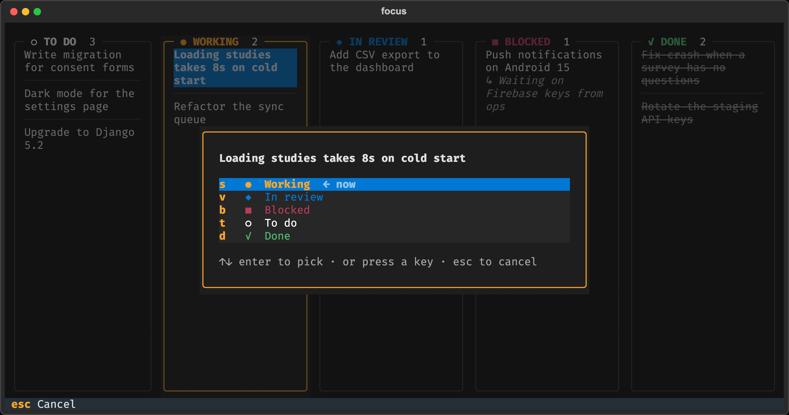
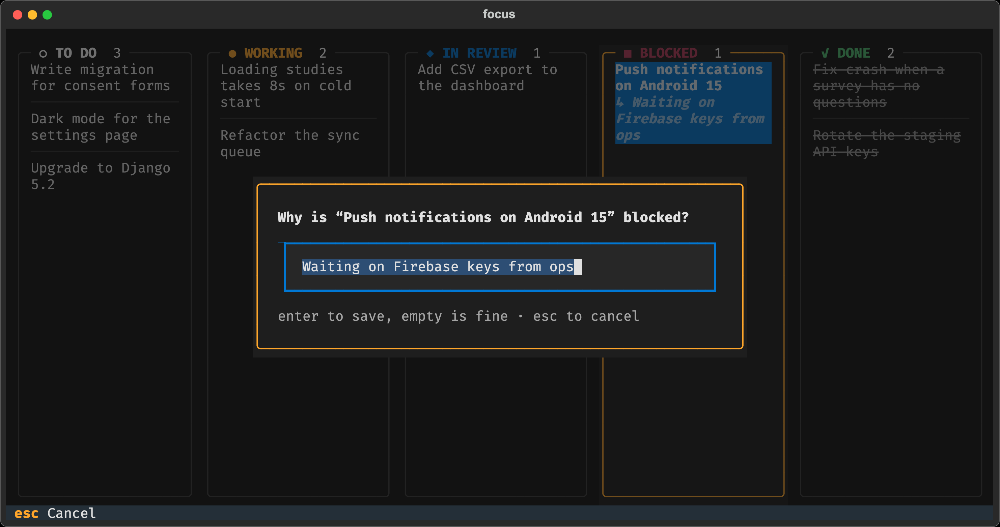
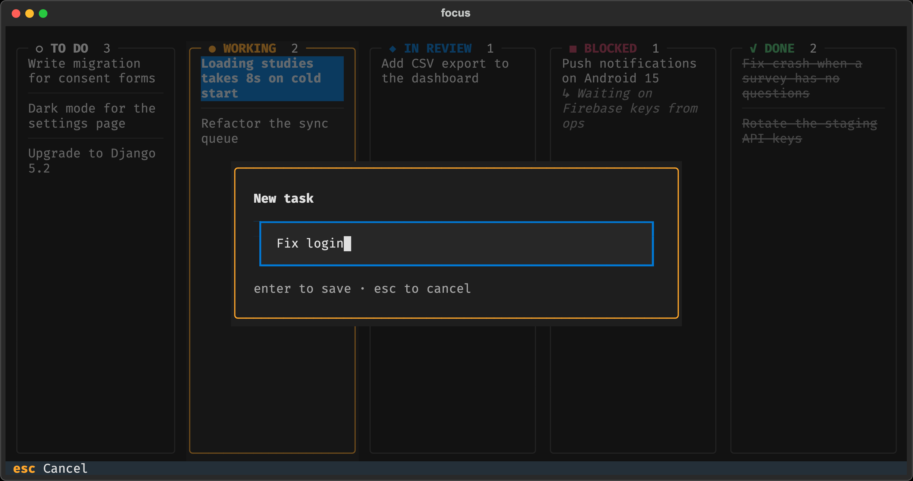
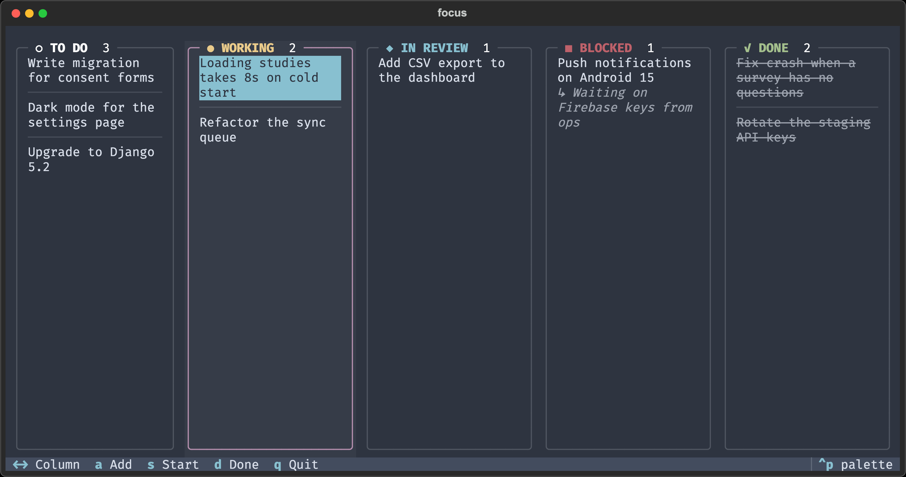
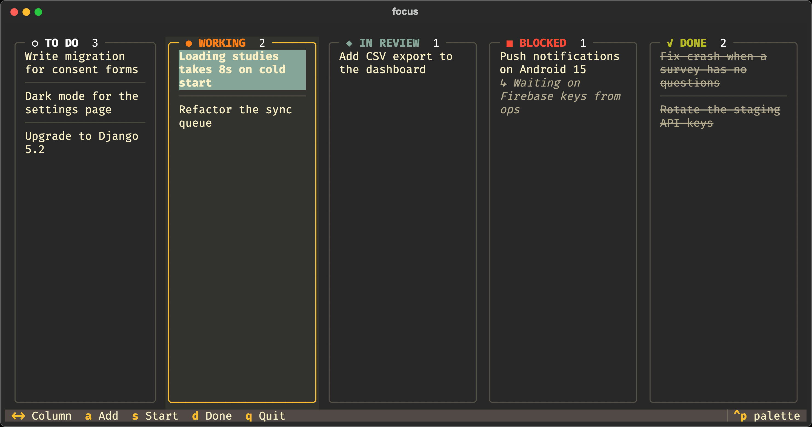
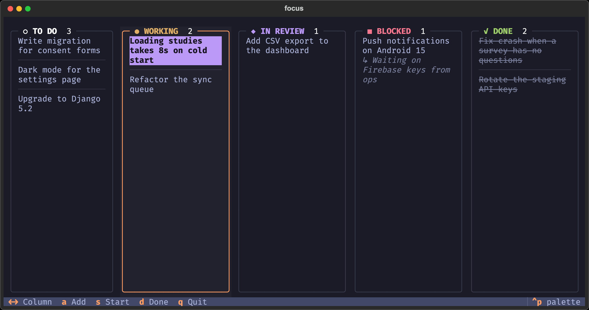
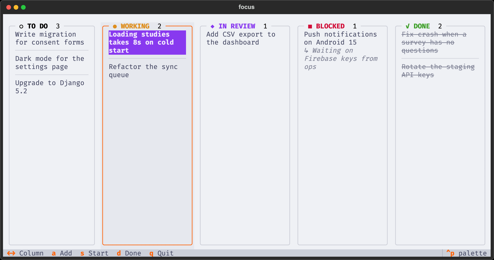

# focus

A minimal terminal workboard. When you are juggling several tasks across terminal
tabs and Claude Code sessions and lose the thread, type `focus` and see what you
were doing.



Each status is a column, with its task count in the header, so the whole board
reads at a glance.

A task is a title and one of five statuses (`TODO`, `WORKING`, `REVIEW`,
`BLOCKED`, `DONE`). Nothing else — no IDs, links, owners, priorities,
deadlines, tags, or time tracking.

## Install

```bash
pipx install .
```

`focus` then works from any directory. Requires Python 3.10+. Built and tested on
macOS.

## Use

```bash
focus                    # open the dashboard
focus add                # add a task (form)
focus add Fix login      # add a task (no form)
focus start login        # ✓ Fix login → WORKING
focus review login
focus done login
focus block login --why waiting on API keys
```

Status commands take any unique part of a task's title, case-insensitive; an
exact title always wins. If it matches more than one task, focus lists them and
changes nothing.

On the dashboard: `←→` switch column · `↑↓` move within it · `a` add · `r` reload ·
`q` quit.

### Moving a task

Press a status key on the highlighted task — the highlight follows it to its new
column:

`s` start · `v` review · `b` block · `t` to do · `d` done

Or press `Enter` to pick from a list, with the current status highlighted. The
same keys work there; `esc` cancels.



### Blocked tasks

Blocking a task asks why. The answer shows under the task in the Blocked column,
so you can tell at a glance what each one is waiting on. Press `b` again to edit
it, or leave it empty. Moving the task out of Blocked clears it.



### Adding a task

`a` on the dashboard, or `focus add` from the shell. Type a title, press
`Enter`. New tasks start as `TODO`; `esc` cancels.



## Themes

`ctrl+p` opens the command palette, where *Change theme* previews any of Textual's
themes for the current session. To keep one, set `FOCUS_THEME` in your shell
profile:

```bash
export FOCUS_THEME=nord
```

| `nord` | `gruvbox` |
| :--- | :--- |
|  |  |

| `tokyo-night` | `catppuccin-latte` |
| :--- | :--- |
|  |  |

Any Textual theme name works — `dracula`, `monokai`, `solarized-light`,
`rose-pine`, `flexoki`, and the rest. An unknown name is ignored.

## Data

Tasks live in `~/.focus/tasks.json`, created on first write:

```json
[
  {
    "id": "3",
    "title": "Push notifications on Android 15",
    "status": "blocked",
    "reason": "Waiting on Firebase keys from ops"
  }
]
```

Edit it by hand if you like. `id` is focus's internal key — leave it out on new
rows and one is assigned. Fields from older versions (`owner`, `url`, `mr_url`)
are dropped the next time focus saves, and `self-review` tasks become `working`.
`reason` is kept only while a task is blocked.

A file that cannot be parsed is moved aside to `tasks.json.corrupt` rather than
overwritten. Set `FOCUS_HOME` to keep the data somewhere else.

## Tests

```bash
python -m venv .venv && .venv/bin/pip install textual
.venv/bin/python test_focus.py
```

## Limitations

- No delete or edit command — fix mistakes in `tasks.json`.
- Last writer wins; two dashboards open at once can clobber each other's status
  change. Press `r` to reload.

## License

MIT — see [LICENSE](LICENSE).
